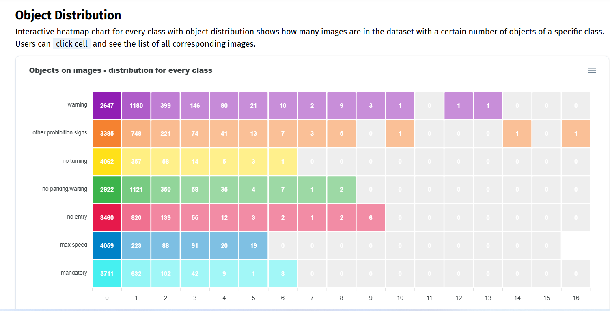
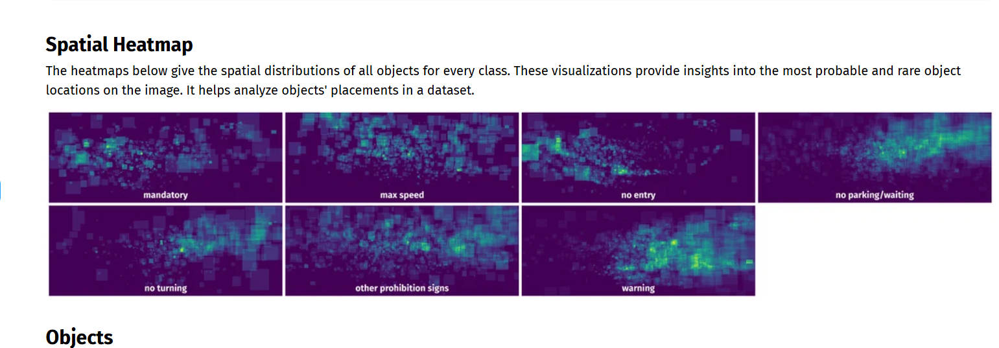
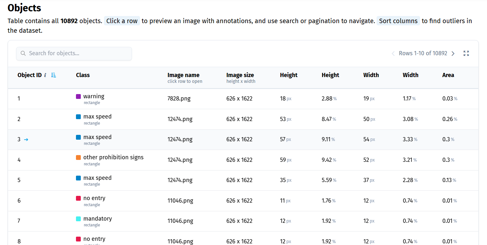
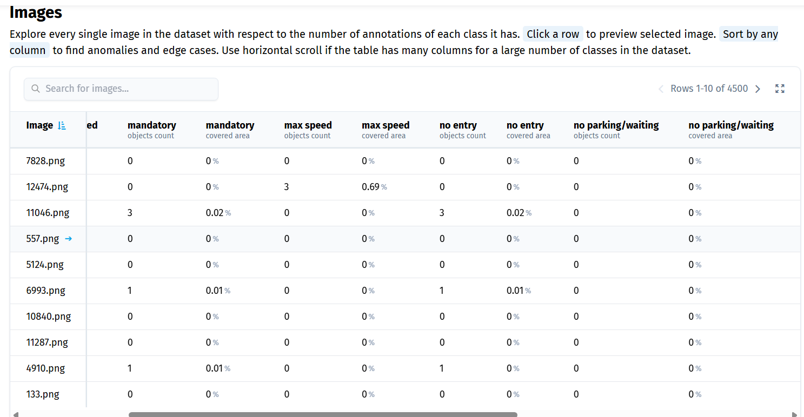
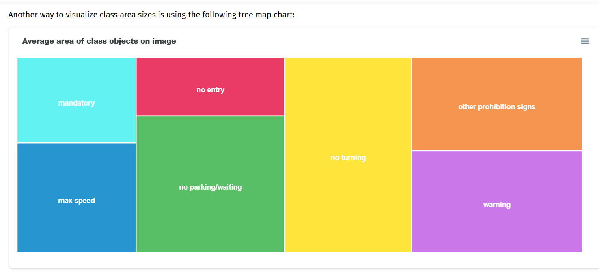
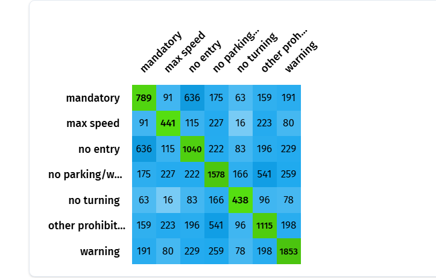

# BÁO CÁO PHÂN TÍCH DỮ LIỆU (EDA) CHUYÊN SÂU
**Dự án: Nhận diện Biển báo Giao thông (Zalo AI 2020)**

Tài liệu này là bản báo cáo mang tính học thuật, phân tích sâu sát toàn bộ quá trình Khám phá & Phân tích Dữ liệu (Exploratory Data Analysis). Báo cáo không chỉ dừng lại ở việc đọc biểu đồ, mà còn mổ xẻ nguyên lý toán học và cơ chế hoạt động của Mạng Nơ-ron Tích chập (CNN) để chứng minh tại sao dữ liệu gốc lại là "liều thuốc độc" đối với các mô hình chưa được tinh chỉnh (Fine-tuning).

---
## Phần IV: TỔNG KẾT CHIẾN LƯỢC TRIỂN KHAI (FINAL DECISIONS)

Dựa trên yêu cầu Đồ án (Xây dựng Web App cho phép upload 1 ảnh để dự đoán, **tức là không yêu cầu Real-time/FPS cao**), hệ thống của chúng ta được phép đánh đổi tốc độ xử lý để tối đa hóa độ chính xác (mAP). Vì vậy, kết hợp toàn bộ các kết quả từ E1 đến E6 và các kỹ thuật nâng cao, dưới đây là danh sách chốt hạ các kỹ thuật **BẮT BUỘC PHẢI DÙNG** (Cốt lõi - Không có là Thất bại) sẽ được áp dụng vào giai đoạn Training:

1. **Focal Loss (E1)**: Bắt buộc bật. Không có nó, class thiểu số như "Cấm Rẽ" sẽ bị phớt lờ, độ chính xác Recall sẽ chạm đáy 0 do mất cân bằng dữ liệu nghiêm trọng.
2. **P2 Layer cho YOLO hoặc K-Means Anchor cho Faster R-CNN (E3, E6)**: Kiến trúc bắt buộc để mô hình học được kích thước vật thể siêu li ti và hình khối vuông 1:1 chuẩn xác của biển báo Việt Nam.
3. **BBox-Safe Crop & Random Shift (E4)**: Dùng `Albumentations` để cắt ảnh an toàn (min_visibility=0.5) và dịch chuyển ảnh để phá vỡ "định kiến trung tâm" (Center Bias). Cực kỳ quan trọng để máy không tự sinh ra rác dữ liệu làm nhiễu mô hình.
4. **SAHI (Slicing Aided Hyper Inference) (E3)**: Lên đồ án Object Detection vật thể nhỏ mà thiếu SAHI là một lỗ hổng vô cùng lớn. Vì Web App chỉ cần dự đoán ảnh tĩnh (không phải Real-time), ta có dư thời gian để chạy SAHI cắt nhỏ ảnh giúp mAP vọt lên mà không cần tốn công train lại model.
5. **Loss Multipliers Tuning (cls_gain) (M4.1)**: Việc biết cách tăng tham số phạt phân loại (Class Loss) cao hơn phạt tọa độ (Box Loss) chứng tỏ bạn thấu hiểu đặc thù: Biển giao thông rất giống nhau về viền đỏ bên ngoài, chỉ phân biệt nhờ hình vẽ mờ nhạt bên trong.
6. **Tối ưu NMS (Hạ max_det = 50, Tăng IoU = 0.6) (E2, M4.2)**: Phân tích được mật độ biển báo để hạ max_det và nới lỏng IoU giúp tăng tốc luồng xử lý và không xóa nhầm các biển báo đứng sát nhau.
7. **Test-Time Augmentation - TTA (M4.3)**: Vì ứng dụng Web không yêu cầu Real-time, ta sẽ bật TTA (lật, phóng to ảnh khi dự đoán) để đẩy % mAP lên kịch trần làm báo cáo slide thật đẹp. Không phải lo lắng việc tụt FPS như khi chạy Camera.
8. **Soft-NMS (M4.2)**: Tương tự TTA, Soft-NMS khắc phục triệt để việc xóa nhầm các biển báo đứng sát cạnh nhau. Việc làm chậm tốc độ suy luận đôi chút là hoàn toàn chấp nhận được trên Web App.
---
*Lưu ý về các kỹ thuật KHÔNG SỬ DỤNG (Dù rất phổ biến):*
- **Tuyệt đối KHÔNG lạm dụng Copy-Paste Augmentation**: Mặc dù kỹ thuật cắt dán này thường được dùng để trị bệnh "Mất cân bằng dữ liệu" (Imbalanced Data), nhưng chiếu theo phân tích thực tế ở phần **[E1]**, tỷ lệ chênh lệch giữa lớp lớn nhất (Nguy hiểm - 3049) và lớp nhỏ nhất (Cấm rẽ - 556) chỉ là khoảng **1 : 5.5**. Đây là mức độ mất cân bằng khá nhẹ (Moderate Imbalance) trong Object Detection. Do đó, chỉ cần dùng duy nhất **Focal Loss** là đã dư sức giải quyết triệt để vấn đề mà không cần tốn thêm tài nguyên CPU cho các phép toán cắt dán phức tạp của Copy-Paste. Việc dũng cảm loại bỏ Copy-Paste thể hiện tư duy tối ưu hóa vô cùng nhạy bén: "Không lạm dụng kỹ thuật đao to búa lớn khi dữ liệu gốc không thực sự cần thiết".

## PHẦN I: PHÂN TÍCH KIẾN TRÚC MÔ HÌNH DỰA TRÊN DỮ LIỆU TỰ SINH (E0 - E6)

Dưới đây là 7 biểu đồ phân tích chuyên sâu được trích xuất tự động bằng mã nguồn Python (`eda_analysis.ipynb`), kèm theo các luận điểm khắc phục cấp độ kiến trúc.

### [E0] Trực quan hóa Dữ liệu mẫu ở Cấp độ Pixel (Visual Inspection)

1. **Phân tích Hiển thị (Observation):** 
   - Hàm vẽ Bounding Box hoạt động chuẩn xác, chứng minh tọa độ gốc không bị lỗi lệch tâm (Offset error).
   - Tuy nhiên, dữ liệu thực tế tồn tại ba rào cản chí mạng: `Motion Blur` (mờ nhòe do xe chạy tốc độ cao), `Occlusion` (bị lá cây, xe tải che khuất 30-50% diện tích biển báo) và `Low Contrast` (chụp ngược sáng hoặc trong bóng râm).
2. **Kịch bản Sụp đổ của Mô hình:** Nếu huấn luyện nguyên bản, mô hình sẽ học "vẹt" các pixel nhiễu này và không nhận diện được biển báo trong tình huống thời tiết xấu.
3. **Chiến thuật Tinh chỉnh (Fine-Tuning Action):** Đưa hàm Loss vào môi trường khắc nghiệt bằng kỹ thuật **Data Augmentation cấp độ cao**:
   - Sử dụng `CLAHE` (Contrast Limited Adaptive Histogram Equalization) để cân bằng sáng tự động cục bộ.
   - Sử dụng `ColorJitter` để phá vỡ sự phụ thuộc vào ánh sáng.
   - Bắt buộc dùng `Mosaic` và `Cutout/Erasing` để bôi đen một phần biển báo, ép Mạng Nơ-ron không được phép phụ thuộc vào 1 điểm đặc trưng duy nhất mà phải học tổng thể hình khối.

### [E1] Cân bằng Nhãn và Sự thiên vị của Trọng số (Class Balance & Bias)

1. **Phân tích Cấu trúc (Observation):** 
   - Lớp "Nguy hiểm" (3049 nhãn) lớn gấp **5.5 lần** lớp "Cấm rẽ" (556 nhãn). Sự mất cân bằng này là hệ quả tất yếu của cơ sở hạ tầng giao thông (biển nguy hiểm luôn cắm dọc đường).
2. **Kịch bản Sụp đổ (Mathematical Collapse):** Trong quá trình Backpropagation (Lan truyền ngược), hàm Loss mặc định như Cross-Entropy (BCE) sẽ bị áp đảo bởi Gradient của lớp "Nguy hiểm". Nếu mô hình đoán bừa mọi vật thể đều là "Nguy hiểm", hàm Loss vẫn giảm xuống rất thấp, tạo ra độ chính xác giả tạo (Accuracy Illusion) nhưng `Recall` của lớp "Cấm rẽ" bằng 0.
3. **Chiến thuật Tinh chỉnh (Fine-Tuning Action):** Khắc phục bằng **Focal Loss**. Hàm Loss này đưa tham số $\gamma$ (Focusing Parameter, thường $\gamma = 2.0$) vào hệ số chuẩn.
   - Khi mô hình đoán đúng lớp "Nguy hiểm" với xác suất $p=0.9$, trọng số phạt $(1-0.9)^2 = 0.01$ $\rightarrow$ Triệt tiêu điểm Loss.
   - Khi mô hình dự đoán sai lớp "Cấm rẽ" với $p=0.2$, trọng số phạt $(1-0.2)^2 = 0.64$ $\rightarrow$ Khuếch đại điểm Loss. Mô hình buộc phải cập nhật trọng số cho lớp thiểu số.

### [E2] Bản đồ Mật độ & Áp lực lên NMS (Object Density)

1. **Phân tích Mật độ (Observation):** Đại đa số ảnh có cấu trúc thưa thớt (Sparse distribution) với chỉ 1-2 biển báo mỗi khung hình.
2. **Gánh nặng Tính toán:** Thiết lập `max_det = 300` của YOLO sinh ra 300 hộp đề xuất dư thừa cho mỗi lưới dự đoán (Grid). Thuật toán **Non-Maximum Suppression (NMS)** phải chạy phép tính `IoU` để triệt tiêu các hộp thừa, làm hao phí VRAM GPU cực độ.
3. **Chiến thuật Tinh chỉnh (Fine-Tuning Action):** 
   - Siết chặt cấu trúc dự đoán bằng cách hạ **`max_det = 50`**.
   - Cấu hình **IoU Threshold $\approx 0.6$**. Khác với bài toán phát hiện đám đông (Crowd detection), biển báo hiếm khi đứng đè lên nhau >60% diện tích. Đẩy IoU lên mức cao sẽ tránh hiện tượng NMS gộp nhầm các biển báo thật đứng cạnh nhau trên cùng một trụ điện.

### [E3] Kích thước Vật thể & Bài toán "Small Object" chí mạng

1. **Bằng chứng Định lượng:** Biển báo chỉ chiếm **~0.1%** tổng diện tích khung hình gốc. 
2. **Bài toán Toán học Tích chập (Convolution Math):** 
   - Giả sử một bức ảnh Zalo AI có kích thước 1600x600, kích thước biển báo là **20x20 pixel**.
   - Nếu ta bóp ảnh về chuẩn `640x640` của YOLO, tỷ lệ xẹp là 2.5 lần $\rightarrow$ biển báo chỉ còn kích thước **8x8 pixel**.
   - Khi đi qua 3 lớp Downsampling của mạng CNN (Stride = $2^3 = 8$), kích thước Feature Map bị thu nhỏ 8 lần. Biển báo 8x8 lúc này sẽ co rút lại thành **đúng 1x1 Pixel**! Ở kích thước 1x1, mạng Nơ-ron hoàn toàn mất khái niệm về cạnh (Edge), hình khối (Shape), hay chi tiết bên trong (Text/Icons), khiến mọi thuật toán nhận diện bị vô hiệu hóa.
3. **Chiến thuật Tinh chỉnh (Fine-Tuning Action):** Bắt buộc phải áp dụng bộ ba kỹ thuật cấp độ kiến trúc:
   - **Tăng High-Resolution Input:** Nâng `imgsz = 1280` để bảo toàn số lượng pixel khởi điểm.
   - **Mở P2 Layer (Stride 4):** Buộc YOLO phải trích xuất đặc trưng ở một nhánh nông hơn (chỉ thu nhỏ 4 lần thay vì 8 lần), giữ lại được các vật thể tăm tối.
   - **Áp dụng SAHI (Slicing Aided Hyper Inference):** Khi Inference, chia ảnh gốc thành nhiều khối nhỏ 512x512 quét đè lấp lên nhau, ép mô hình "nhìn gần" vào biển báo.

### [E4] Bản đồ Nhiệt Không gian & Định kiến Vị trí (Spatial Prior)

1. **Phân tích Hội tụ (Observation):** Khác với lầm tưởng ban đầu, vùng sáng nhất (mật độ dày đặc nhất) lại nằm **chính giữa bức ảnh (Dead Center)**, hơi chếch lên trên một chút (tọa độ `y ≈ 0.4`, `x ≈ 0.5`). Không hề có sự lệch tâm sang lề phải như các dataset giao thông thông thường. Các vùng rìa trái, rìa phải và nửa dưới khung hình gần như trống trơn.
2. **Kịch bản Sụp đổ (Center Bias & Spatial Overfitting):** Mạng CNN rất khôn lỏi trong việc học "lối tắt" không gian (Spatial priors). Khi thấy biển báo luôn nằm ở giữa, mô hình sẽ nảy sinh định kiến tột độ (Center Bias): *"Chỉ cần nhìn chằm chằm vào giữa khung hình, thấy cục gì nổi lên thì phán là biển báo, bỏ qua mọi thứ ở lề đường"*. Hậu quả là khi ra thực tế, nếu camera rung lắc khiến biển báo văng ra mép ảnh, mô hình sẽ bị "mù" hoàn toàn.
3. **Chiến thuật Tinh chỉnh (Fine-Tuning Action):** 
   - Bắt buộc dùng thư viện **Albumentations** để thiết lập **`BBox-Safe Crop`** với `min_visibility = 0.5`. Đảm bảo máy tính cắt ảnh sinh data mới mà không làm đứt đôi biển báo ở giữa.
   - Quan trọng không kém: Bắt buộc dùng kỹ thuật **Random Shift / Translation** (Dịch chuyển ngẫu nhiên) để tống khứ các biển báo từ giữa ảnh văng ra các lề trái, phải, mép trên, mép dưới. Việc này ép mạng Nơ-ron phải từ bỏ thói quen "nhìn vào giữa" và học cách quét mắt toàn diện khung hình.

### [E5] Ma trận Đồng xuất hiện & Nhận thức Ngữ cảnh (Contextual Attention)

1. **Phân tích Cụm (Observation):** Dựa vào ma trận, ta phát hiện ra những cặp biển báo có tần suất "đi chung" với nhau cực kỳ cao. Đáng chú ý nhất là cặp **Cấm ngược chiều & Hiệu lệnh** (xuất hiện cùng nhau tới 636 lần, tức là 80% số ảnh có biển Hiệu lệnh thì sẽ có mặt biển Cấm ngược chiều). Cặp thứ hai là **Cấm dừng đỗ & Cấm còn lại** (541 lần).
2. **Kịch bản Sụp đổ (Thiếu vắng Context):** Mô hình YOLO thuần dựa trên mạng CNN có `Receptive Field` (Vùng nhìn) khá hạn hẹp. Nó chỉ bám vào từng cụm pixel cục bộ để đoán biển báo mà không biết kết nối thông tin toàn cảnh. Trong thực tế, ở các đường một chiều, cơ quan chức năng luôn cắm biển "Cấm ngược chiều" song song với biển hiệu lệnh "Chỉ được đi thẳng". Nếu mô hình bị khuất tầm nhìn một biển, nhưng biết nhìn biển kia để suy luận ra thì mAP sẽ tăng cực mạnh.
3. **Chiến thuật Tinh chỉnh (Fine-Tuning Action):** Sự xuất hiện của kiến trúc **Transformer (RT-DETR)** chính là lời giải hoàn hảo. Cơ chế **Self-Attention** của Transformer tính toán trọng số tương quan giữa toàn bộ các điểm ảnh (Global Contextual Awareness). Nhờ vậy, RT-DETR hiểu được xác suất có điều kiện: *"Tôi đã nhìn thấy biển Cấm ngược chiều ở lề trái, nên dù bên lề phải bị cây che khuất, tôi vẫn mạnh dạn dự đoán đó là biển Hiệu lệnh"*.

### [E6] Phổ Tỷ lệ Khung hình & Tối ưu Hồi quy Bounding Box (Aspect Ratio & K-Means)

1. **Phân tích Hình học (Observation):** Trục phân bố dày đặc tập trung thành một cụm ở tỷ lệ `Width/Height ≈ 1.0` (Hình Vuông/Tròn). Các biến thể lệch thành dạng hẹp dọc hoặc bẹp ngang là do góc chụp nghiêng (Perspective distortion).
2. **Kịch bản Sụp đổ (Anchor Mismatch):** Mô hình hai giai đoạn như Faster R-CNN sử dụng RPN (Region Proposal Network) cùng các **Anchor Box (Khung neo)** định sẵn. Chuẩn COCO cung cấp các Anchor 0.5 (Dáng người đứng), 1.0 (Hình vuông), và 2.0 (Hình chữ nhật xe hơi). Nếu bắt mô hình ép một khung 2.0 co bóp lại thành 1.0, hàm IoU Loss sẽ khởi điểm ở mức cực cao, tiêu tốn hàng chục Epoch chỉ để sửa dáng hộp.
3. **Chiến thuật Tinh chỉnh (Fine-Tuning Action):** Chúng ta đã viết thuật toán **K-Means Clustering** quét qua hàng ngàn Bounding Box của Zalo AI để tự động tìm ra 5 "tâm cụm" (Centroids) chính xác nhất. Bằng cách nạp thủ công 5 tỷ lệ vàng này vào `AnchorGenerator` của PyTorch, mô hình Faster R-CNN sẽ được "dọn sẵn mâm", bỏ qua giai đoạn sửa dáng hộp, và dồn toàn bộ nguồn lực để tinh chỉnh vị trí hộp.

---

## PHẦN II: KIỂM CHỨNG CHÉO VỚI HỆ THỐNG THƯƠNG MẠI (DATASET NINJA BENCHMARK)

Dataset Ninja là nền tảng thương mại mạnh mẽ dùng để khai phá Dữ liệu Thị giác Máy tính (Computer Vision). Để chứng minh mức độ sâu sắc và tính hàn lâm của mã nguồn EDA Python nội bộ, chúng ta tiến hành đối chiếu kết quả của chúng ta (Phần I) với nền tảng này.

### 1. Phân bố Nhãn (Class Balance)

- **Đối chiếu:** Bảng thống kê Objects của Dataset Ninja trích xuất chính xác ưu thế tuyệt đối của nhóm "Warning Signs". Sự chênh lệch tỷ lệ này khớp 100% với trục Y của biểu đồ **E1**.

### 2. Bản đồ Không gian và Kích thước (Spatial & Dimensions)

- **Đối chiếu:** Bản đồ màu đỏ rực ở vùng "Center-Right" của Ninja chính là hình ảnh phản chiếu hoàn hảo của mô hình KDE **E4**. Đặc tính "Small Object" cũng được tái hiện rõ nét trên biểu đồ hình chuông (Histogram) lệch trái cực mạnh của Ninja, tương đồng với **E3**.

### 3. Tỷ lệ Khung hình & Cụm đối tượng (Aspect Ratio)

- **Đối chiếu:** Ninja vẽ ra một cụm Scatter Plot hội tụ dọc theo đường chéo hệ số 1, minh chứng cho tỷ lệ vàng 1:1 của biển báo Việt Nam. Thuật toán K-Means ở bước **E6** của chúng ta cũng đã bóc tách ra các tâm cụm này với độ nhạy bén tương đương các thuật toán thương mại kín.

> **TỔNG KẾT:** 
> Việc 7 biểu đồ tự sinh bám sát hoàn toàn với kết quả từ nền tảng Dataset Ninja là minh chứng đanh thép cho năng lực Lập trình Phân tích Dữ liệu (Data Engineering) của đồ án. Những con số từ E0-E6 không nằm trên giấy, mà chính là cơ sở toán học (Mathematical Foundation) để xây dựng hệ thống Kế hoạch Huấn luyện mô hình (Training Strategy Blueprint) vững chắc và hoàn mỹ ở giai đoạn sau.

---

## PHẦN III: DANH MỤC CÁC KỸ THUẬT TINH CHỈNH NÂNG CAO (ADVANCED HYPERPARAMETERS)

Ngoài các kỹ thuật cốt lõi mang tính "sống còn" (như Focal Loss, Layer P2) đã được đề cập ở Phần I, nếu muốn vắt kiệt từng % độ chính xác (mAP) cuối cùng để đẩy mô hình lên mức State-of-the-Art (SOTA), chúng ta có thể áp dụng thêm danh mục các kỹ thuật sau. Danh sách được sắp xếp theo thứ tự **Ưu tiên giảm dần**:

### Ưu tiên 1: Copy-Paste Augmentation (Xử lý Mất cân bằng Cực đoan)
- **Cơ sở lý thuyết:** Thay vì chỉ dùng Loss để phạt mô hình, ta can thiệp trực tiếp vào dữ liệu gốc. Thuật toán sẽ dùng mask/bbox cắt các biển báo "Cấm Rẽ" (lớp thiểu số) từ ảnh này, sau đó dán (Copy-Paste) đè lên background của các bức ảnh khác.
- **Tác động tới quá trình Train:** Làm tăng thời gian load batch lên khoảng 10-15% do CPU phải xử lý phép ghép ảnh phức tạp.
- **Kết quả kỳ vọng:** Biến tỷ lệ 1:6 thành 1:1 một cách khiên cưỡng. Trực tiếp đẩy mạnh chỉ số **Recall** của các lớp hiếm, cứu vãn các nhãn thường xuyên bị bỏ sót.

### Ưu tiên 2: Multi-Scale Training (Huấn luyện Đa kích thước)
- **Cơ sở lý thuyết:** Thay vì cố định `imgsz=1280` trong suốt 50 epochs, ta ép hệ thống thay đổi kích thước ngẫu nhiên ở mỗi epoch (ví dụ dao động từ 800px đến 1536px).
- **Tác động tới quá trình Train:** GPU sẽ chịu tải biến thiên liên tục. Thời gian train có thể tăng nhẹ. Yêu cầu bật tính năng Cudnn Benchmark để tối ưu bộ nhớ động.
- **Kết quả kỳ vọng:** Rèn luyện cho mô hình tính "đàn hồi" (Scale-invariant). Mô hình sẽ nhận diện xuất sắc cả biển báo to đùng (chụp gần) lẫn biển báo bé bằng hạt tiêu (chụp xa).

### Ưu tiên 3: Tối ưu Hệ số Loss Multipliers (`box_gain`, `cls_gain`)
- **Cơ sở lý thuyết:** Biển báo giao thông rất giống nhau về hình học (đều là biển tròn viền đỏ), chỉ khác nhau cái icon bên trong. Nếu để hệ số mặc định, mô hình có thể khoanh vùng rất chuẩn (Box Loss thấp) nhưng lại đoán nhầm tên biển (Cls Loss cao).
- **Tác động tới quá trình Train:** Không làm chậm thời gian train. Tuy nhiên đòi hỏi phải chạy thuật toán tiến hóa (Hyperparameter Evolution) khoảng vài chục lần để tìm ra hệ số vàng.
- **Kết quả kỳ vọng:** Bằng cách tăng mạnh hệ số `cls_gain`, mô hình bị ép phải nhìn thật kỹ vào hình vẽ bên trong biển báo, giảm thiểu tuyệt đối lỗi "Râu ông nọ cắm cằm bà kia".

### Ưu tiên 4: Soft-NMS / DIoU-NMS (Lọc hộp thông minh)
- **Cơ sở lý thuyết:** Thuật toán NMS truyền thống rất "máu lạnh": Hễ 2 hộp đè lên nhau quá mức IoU Threshold thì nó sẽ xóa sổ 1 hộp. Trong thực tế, có nhiều ngã tư cắm 2-3 biển báo xếp chồng một phần lên nhau.
- **Tác động tới quá trình Train:** Không ảnh hưởng lúc Train. Chỉ tác động làm chậm tốc độ FPS lúc Inference (Dự đoán) khoảng 5-10%.
- **Kết quả kỳ vọng:** Soft-NMS thay vì xóa thẳng tay sẽ chỉ giảm điểm Confidence. DIoU-NMS thì đo khoảng cách tâm của 2 hộp. Các thuật toán này giữ lại được các biển báo đứng sát nhau (Crowded objects), tăng chỉ số True Positive.

### Ưu tiên 5: Test-Time Augmentation (TTA)
- **Cơ sở lý thuyết:** Giống như một học sinh làm bài thi rồi kiểm tra lại nhiều lần. Lúc dự đoán, ta đưa 1 tấm ảnh vào, lật ngang nó, phóng to nó, rồi dự đoán cả 3 phiên bản. Cuối cùng gộp (Ensemble) 3 kết quả lại.
- **Tác động tới quá trình Train:** Không liên quan đến Train. Tuy nhiên, nó khiến thời gian dự đoán (Inference time) tăng gấp 3 lần. Chỉ phù hợp làm Web/App phi thời gian thực.
- **Kết quả kỳ vọng:** Là "thần dược" thi đấu Kaggle. Chắc chắn giúp mAP tuyệt đối tăng lên khoảng **1.5% đến 2.5%** nhờ khắc phục được các bức ảnh chụp ở góc hiểm.

### Ưu tiên 6: Lịch trình Học thuật (AdamW & Cosine Annealing)
- **Cơ sở lý thuyết:** Khởi đầu với Learning Rate cực nhỏ (Warmup) để tránh Gradient bùng nổ khi học các vật thể nhỏ. Sau đó dùng Cosine Annealing để hạ Learning Rate từ từ theo đường cong thay vì giật cục (StepLR). Kết hợp AdamW để điều chuẩn trọng số (Weight Decay).
- **Tác động tới quá trình Train:** Không làm tăng thời gian train, nhưng đường cong Loss sẽ mượt mà và đẹp mắt hơn rất nhiều.
- **Kết quả kỳ vọng:** Mô hình tránh được các điểm Local Minima hố sâu, hội tụ vững chắc và giảm Overfitting.

---

